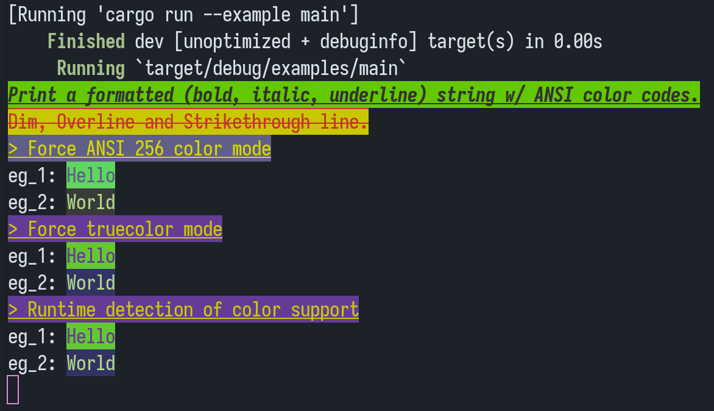
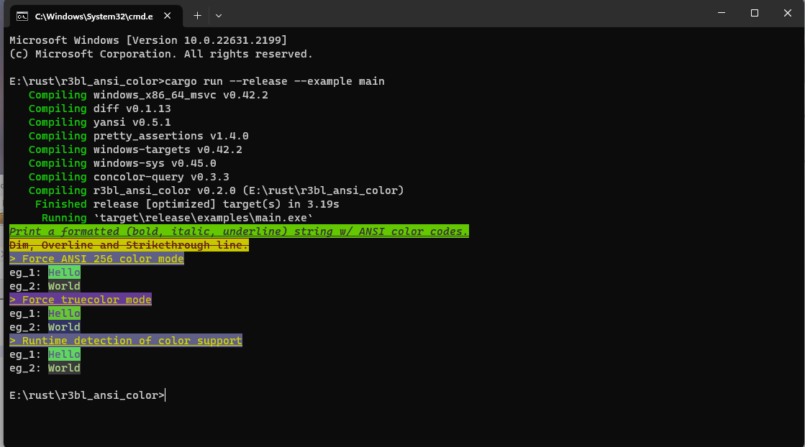

# r3bl_ansi_color crate
<a id="markdown-r3bl_ansi_color-crate" name="r3bl_ansi_color-crate"></a>

<!-- TOC -->

- [What does it do?](#what-does-it-do)
- [How to use it?](#how-to-use-it)
- [Build, run, test tasks](#build-run-test-tasks)
- [References](#references)

<!-- /TOC -->

## What does it do?
<a id="markdown-what-does-it-do%3F" name="what-does-it-do%3F"></a>

Rust crate to generate formatted ANSI 256 (8-bit) and truecolor (24-bit) color output to stdout. On
macOS, the default Terminal.app does not support truecolor, so ANSI 256 colors are used instead.

> This crate performs its own detection of terminal color capability heuristically. And does not
> use other crates to perform this function.

Here's a screenshot of running the `main` example on various operating systems:

|  |
|:--:|
| *Running on Linux Tilix* |

|  |
|:--:|
| *Running on Windows Terminal* |

## How to use it?
<a id="markdown-how-to-use-it%3F" name="how-to-use-it%3F"></a>

The main struct that we have to consider is `AnsiStyledText`. It has two fields:

- `text` - the text to print.
- `style` - a list of styles to apply to the text.

Here's an example.

```rust
AnsiStyledText {
    text: "Print a formatted (bold, italic, underline) string w/ ANSI color codes.",
    style: &[
        Style::Bold,
        Style::Italic,
        Style::Underline,
        Style::Foreground(Color::Rgb(50, 50, 50)),
        Style::Background(Color::Rgb(100, 200, 1)),
    ],
}
.println();
```

Please a look at the
[`main` example](https://github.com/r3bl-org/r3bl_ansi_color/blob/main/examples/main.rs) to get a
better idea of how to use this crate.

## Build, run, test tasks
<a id="markdown-build%2C-run%2C-test-tasks" name="build%2C-run%2C-test-tasks"></a>

- Build: `cargo build`
- Run examples: `cargo run --example main`
- Run tests: `cargo test`

[Fish scripts](https://developerlife.com/2021/01/19/fish-scripting-manual/) are provided to
facilitate the above tasks. Here is a list of them.

- Build
  1. `build.fish` - build the crate.
- Run
  1. `run.fish` - run the examples.
  1. `run-watch.fish` - watch the files in this folder and re-run the examples when they change.
  1. `run-release.fish` - run the examples in release mode.
  1. `run-with-flamegraph-profiling.fish` - run the examples with flamegraph profiling.
- Test
  1. `cargo-watch-all-tests.fish` - watch the files in this folder and re-run the tests when
  1. `test.fish` - run the tests.
  1. `cargo-watch-one-test.fish` - same as above, but just watch a single test passed in as an
     argument to this script.
  1. `cargo-watch-macro-expand-one-test.fish` - same as above, but also expand all the macros that
     are used in the test.
- Clippy
  1. `clippy.fish` - run clippy and re-run it when the files in this folder change.
- Docs
  1. `doc.fish` - generate the Rust docs.
  1. `serve-doc.fish` - serve the Rust docs on `http://localhost:3000`. This is useful when using
     SSH to connect to a remote machine to actually do development work on and you want to view the
     docs on your local machine. Make sure you have `node` and `npm` and `serve` installed. If not
     you can get it with [`brew`](https://brew.sh/).

## References
<a id="markdown-references" name="references"></a>

- https://notes.burke.libbey.me/ansi-escape-codes/
- https://www.asciitable.com/
- https://commons.wikimedia.org/wiki/File:Xterm_256color_chart.svg
- https://www.ditig.com/256-colors-cheat-sheet
- https://stackoverflow.com/questions/4842424/list-of-ansi-color-escape-sequences
- https://www.compuphase.com/cmetric.htm

## Why make a new crate for this?

- There are a few crates on crates.io that do similar things but they don't amenable
  licenses.
- Other crates simply ignore ANSI 256 colors and only support truecolor, even when they
  claim that they support it.
- And there are other crates which don't correctly report that macOS Terminal.app does not
  support truecolor and only supports ANSI 256 color.

Here are some links:

1. <https://github.com/rust-cli/concolor/issues/47>
1. <https://docs.rs/anstream/latest/anstream/>
1. <https://docs.rs/colorchoice/latest/colorchoice/>
1. <https://docs.rs/colorchoice-clap/latest/colorchoice_clap/>
1. <https://docs.rs/anstyle-query/latest/anstyle_query/fn.term_supports_ansi_color.html>
1. <https://crates.io/crates/anstyle-query>
1. <https://docs.rs/supports-color/2.0.0/supports_color/>
1. <https://crates.io/crates/ansi_colours>
1. <https://crates.io/crates/colored>
